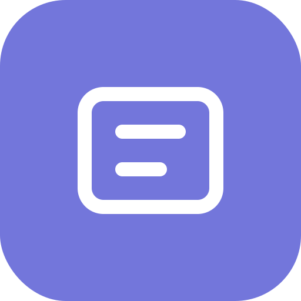

# QuickText - JemaOS Text Editor

<p align="center">
  
</p>

QuickText is a fast and simple text editor developed by **Jema Technology** for the JemaOS ecosystem. It runs as a Progressive Web App (PWA) and can be installed on any modern browser, including Chrome OS.

## Features

- 📝 **Fast & Simple**: Lightweight text editor with instant load times
- 🌐 **PWA Support**: Install as a native app on desktop and mobile
- 🔤 **Syntax Highlighting**: Support for multiple programming languages
- 🎨 **Customizable**: Themes, fonts, and text formatting options
- 📱 **Cross-Platform**: Works on Chrome OS, Windows, macOS, Linux
- 📂 **File Associations**: Open .txt files directly with QuickText

## Supported File Types

- Text files: `.txt`, `.text`, `.log`, `.md`, `.rtf`
- Web: `.html`, `.htm`, `.css`
- Programming: `.js`, `.json`, `.py`, `.c`, `.cpp`, `.java`, `.rs`, `.go`

## Installation

## Development

### Prerequisites
- Node.js 18+
- npm or yarn

### Setup
```bash
# Install dependencies
npm install

# Run development server
npm run dev
```

### Build for Production
```bash
npm run build
```

## Technology Stack

- **CodeMirror 6**: Text editor core
- **Material Design**: UI components
- **PWA**: Service Worker for offline support
- **Chrome App API**: File system access (via shim)

## License

Copyright (c) 2026 Jema Technology Authors. All rights reserved.

See [LICENSE.md](LICENSE.md) for details.

## Jema Technology

QuickText is part of the JemaOS project - a suite of web applications designed for productivity.

- 🌐 Website: https://www.jematechnology.fr
